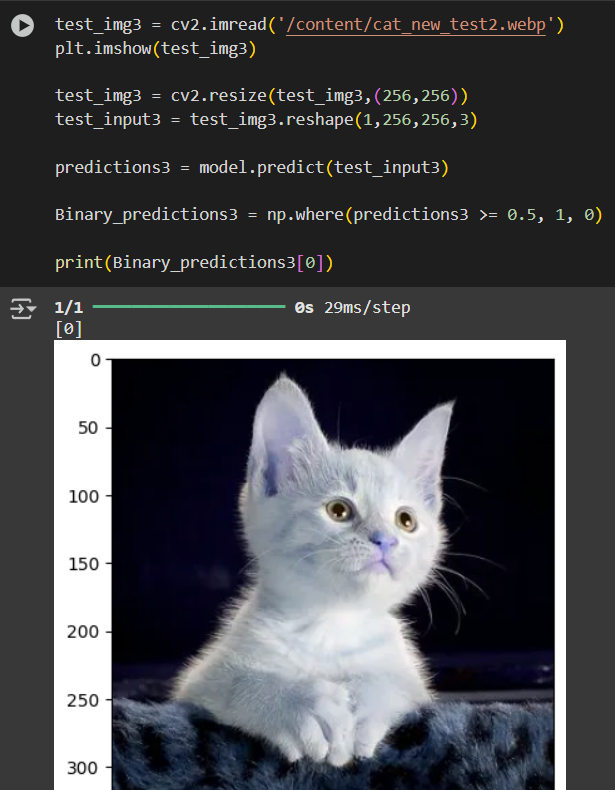
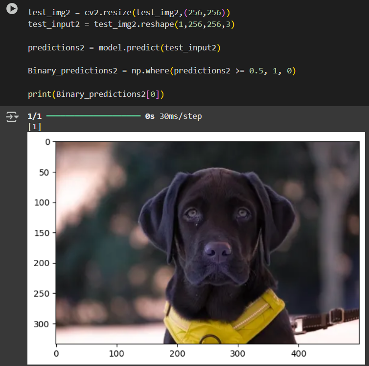

# 🐱🐶 Binary Image Classifier: Cat vs Dog

Welcome to the **Cat vs Dog Binary Image Classifier**!  
This exciting project implements a deep learning model that can differentiate between images of cats and dogs with impressive accuracy.  
Using **Convolutional Neural Networks (CNNs)** and **TensorFlow/Keras**, the model is trained on a rich dataset of labeled cat and dog images, with the ultimate goal of classifying any input image as either a cat or a dog.

Whether you’re building your first CNN model or tackling image classification, this project is a great showcase of how deep learning can be used to solve real-world challenges.

---

## 🚀 Key Features

- **🌀 Data Augmentation:**  
  Random transformations like rotations, flips, and zooms make the model more robust and capable of handling unseen variations in images.

- **🧠 Advanced Model Architecture:**  
  Built with a CNN that includes multiple convolutional, pooling, and dense layers, enabling the extraction of hierarchical patterns and features directly from images.

- **📊 Training & Validation:**  
  Dataset split into training and validation sets, with real-time data augmentation applied during training to prevent overfitting.

- **⚖️ Binary Classification:**  
  Model outputs a probability score for cat (0) or dog (1) with a threshold of 0.5.

- **🔄 BatchNormalization:**  
  Speeds up training and improves stability in deeper architectures.

- **❌ Dropout:**  
  Reduces overfitting by randomly disabling neurons during training.

---

## 📸 Model in Action

  
*Example output from the trained model* 
*0 represents its a cat *

  
*Example output from the trained model* 
*1 represents its a dog *

---

## 🔍 Overview

This project uses a **CNN architecture** with **TensorFlow/Keras** to classify cat and dog images.  
Performance is achieved by combining:
- Data Augmentation
- Careful Model Architecture
- BatchNormalization
- Dropout to prevent overfitting

---

## 📦 Installation

```bash
git clone https://github.com/Om-Bhati/Cat-vs-Dog-Classifier.git
cd Cat-vs-Dog-Classifier
pip install -r requirements.txt
